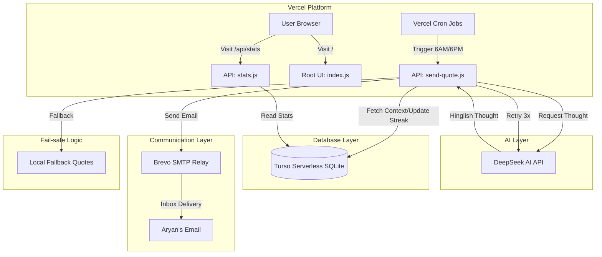

# 🏗️ ThoughtDrop Architecture

ThoughtDrop is built on a modern, serverless stack designed for high availability, zero maintenance, and cost-efficiency.

## 📊 System Architecture Diagram

## 🚀 Technology Stack

| Component | Technology | Benefit |
| :--- | :--- | :--- |
| **Runtime** | Node.js (ES Modules) | Modern, fast, and industry-standard. |
| **Hosting** | Vercel | Serverless functions with built-in cron support. |
| **Database** | Turso (libsql) | Edge-ready SQLite with extremely low latency. |
| **AI Model** | DeepSeek-Chat | High-quality Hinglish generation at a fraction of GPT-4 cost. |
| **Email** | Brevo SMTP | Reliable delivery with high deliverability rates. |
| **Styling** | Tailwind CSS | Rapid UI development for the landing page. |

## 💡 Why Serverless?

1.  **Zero Cold Starts:** Using optimized Node.js functions on Vercel ensures quick execution.
2.  **Cost Efficiency:** You only pay for what you use. For a project like this, it stays within the **Free Tier** indefinitely.
3.  **No Server Management:** No need to worry about OS updates, security patches, or scaling.
4.  **Global Distribution:** Turso and Vercel place your code and data close to the user.

## 🔐 Security & Reliability

-   **Cron Guard:** The `send-quote` endpoint checks for the `x-vercel-cron` header to prevent unauthorized triggers.
-   **Retry Logic:** If DeepSeek is down or slow, the system retries 3 times before using a high-quality fallback quote.
-   **Duplicate Prevention:** Every generated thought is checked against the last 20 entries in Turso to ensure freshness.
